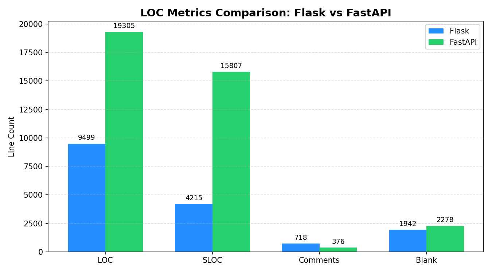
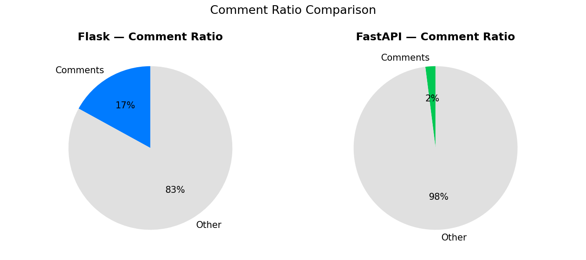
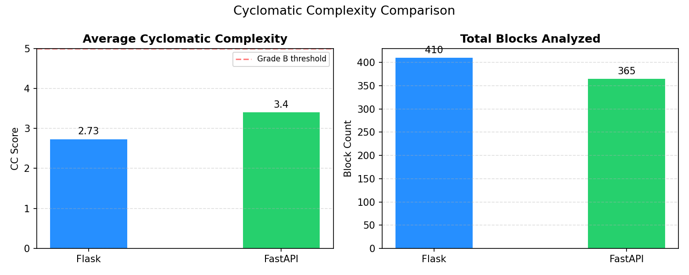
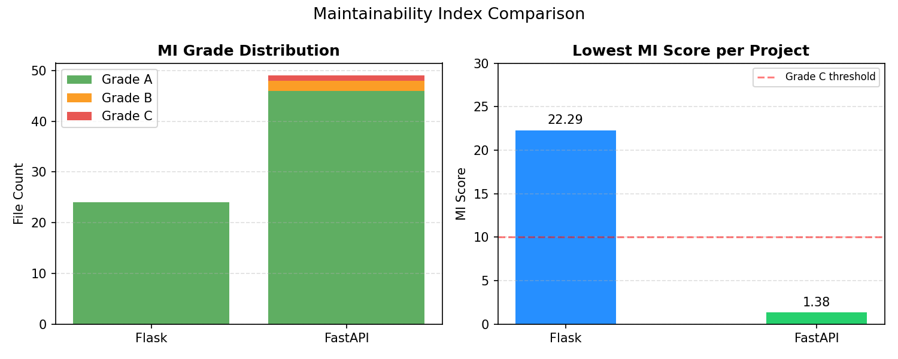

# Software Metrics Analysis: Flask vs FastAPI

A comparative software metrics study of two widely-used Python web frameworks —
**Flask** and **FastAPI** — using the [Radon](https://radon.readthedocs.io/) 
static analysis tool.

---

## 📌 Project Overview

This project analyzes and compares the internal code quality of Flask and FastAPI
through three core software metrics:

- **Lines of Code (LOC)** — codebase size and documentation ratio
- **Cyclomatic Complexity (CC)** — decision complexity per function
- **Maintainability Index (MI)** — overall ease of maintenance

---

## 🔧 Tools Used

| Tool | Purpose |
|------|---------|
| [Radon](https://radon.readthedocs.io/) | Static metrics collection |
| Python 3.x | Analysis scripting |
| Matplotlib | Data visualization |
| Git | Source code retrieval |

---

## 📊 Key Findings

### Lines of Code

| Metric | Flask | FastAPI |
|--------|-------|---------|
| Total LOC | 9,499 | 19,305 |
| Source LOC (SLOC) | 4,215 | 15,807 |
| Comment Ratio | 17% | 2% |




> FastAPI's SLOC is 3.7x larger than Flask's, yet their logical LOC values
> are nearly identical (3,460 vs 3,787), suggesting both frameworks perform
> a comparable amount of logical work.

---

### Cyclomatic Complexity

| Metric | Flask | FastAPI |
|--------|-------|---------|
| Average CC | 2.73 | 3.40 |
| Grade | A | A |
| Total Blocks | 410 | 365 |
| Avg Lines/Block | ~10 | ~43 |



> Both projects achieved Grade A. However, FastAPI's functions are on average
> 4x longer, indicating higher per-function responsibility.

---

### Maintainability Index

| Metric | Flask | FastAPI |
|--------|-------|---------|
| Grade A Files | 24 (100%) | 46 (96%) |
| Grade B Files | 0 | 2 |
| Grade C Files | 0 | 1 |
| Lowest MI Score | 22.29 | 1.38 ⚠️ |



> Flask achieved perfect Grade A across all files. FastAPI's
> `dependencies/utils.py` scored an MI of **1.38 (Grade C)**,
> indicating a critical maintainability risk in its dependency
> injection engine.

---

## 🧠 Conclusion

| Dimension | Flask | FastAPI |
|-----------|-------|---------|
| Code Size | Minimal ✅ | Large |
| Documentation | Strong ✅ | Relies on type hints |
| Complexity | Lower ✅ | Slightly higher |
| Maintainability | Perfect ✅ | 1 critical file ⚠️ |

Flask excels in simplicity and maintainability, making it ideal for smaller
projects where long-term code health is a priority. FastAPI's complexity is
largely justified by its feature set, but `dependencies/utils.py` represents
a real technical debt risk that warrants refactoring.

---

## 🚀 How to Reproduce

```bash
# Clone this repo
git clone https://github.com/YOUR_USERNAME/software-metrics-flask-vs-fastapi
cd software-metrics-flask-vs-fastapi

# Install dependencies
pip install radon matplotlib numpy

# Clone the frameworks
git clone https://github.com/pallets/flask flask_repo
git clone https://github.com/tiangolo/fastapi fastapi_repo

# Run analysis
radon raw flask_repo/src -s
radon cc flask_repo/src -a -s
radon mi flask_repo/src -s

# Generate charts
python metrics_charts.py
```
## 📁 Repository Structure
```
software-metrics-flask-vs-fastapi/
│
├── metrics_charts.py        # Analysis & visualization script
├── results/
│   ├── chart_1_loc.png
│   ├── chart_2_comment_ratio.png
│   ├── chart_3_cyclomatic.png
│   └── chart_4_maintainability.png
└── README.md
```

## 👥 Author

- Havva Nur Angı — Technical Analysis

*Software Metrics Course Project — 2026*
